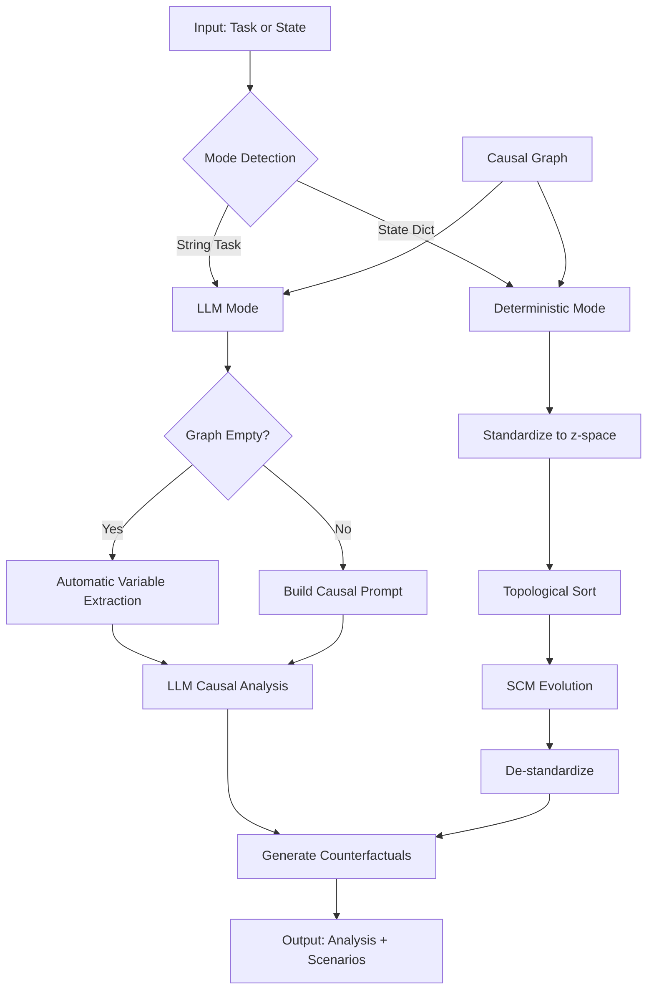

# CR-CA: Causal Reasoning and Counterfactual Analysis Framework

**Version**: v1.3.0  
**Repository**: [https://github.com/IlumCI/CR-CA](https://github.com/IlumCI/CR-CA)  
**License**: Apache-2.0

CR-CA is a comprehensive framework for causal reasoning and counterfactual analysis, combining structural causal models (SCMs) with large language model (LLM) integration. The framework enables sophisticated causal inference, automatic variable extraction from natural language, deterministic causal simulation, and comprehensive counterfactual scenario generation. Designed for both research and practical applications, CR-CA provides a modular architecture supporting specialized agents for quantitative trading, socioeconomic dynamics, and corporate governance.

---

## Quick Reference Tables

### Feature Matrix

| Feature | Core CRCAAgent | CRCA-SD | CRCA-CG | CRCA-Q |
|---------|----------------|---------|---------|--------|
| Automatic Variable Extraction | ✓ | ✓ | ✓ | ✓ |
| LLM-Based Causal Analysis | ✓ | ✓ | ✓ | ✓ |
| Deterministic Simulation | ✓ | ✓ | - | ✓ |
| Counterfactual Generation | ✓ | ✓ | ✓ | ✓ |
| Batch Prediction | ✓ | - | - | ✓ |
| Async Operations | ✓ | - | - | ✓ |
| Optimization Methods | ✓ | ✓ | - | ✓ |
| Time-Series Analysis | ✓ | - | - | ✓ |
| Bayesian Inference | ✓ | - | - | ✓ |
| Data Source Integration | - | - | - | ✓ |

### Module Overview

| Module | Purpose | Key Components |
|--------|---------|----------------|
| `CRCA.py` | Core causal reasoning agent | CRCAAgent, automatic extraction, dual-mode operation |
| `utils/` | Utility functions and extensions | Formatter, TUI, router, conversation management |
| `tools/` | External tool integration | MCP client utilities, protocol handling |
| `templates/` | Agent creation framework | Base agents, feature mixins, module registry |
| `schemas/` | Type definitions | MCP schemas, data structures |
| `crca_sd/` | Socioeconomic dynamics | MPC solver, governance, real-time monitoring |
| `crca_cg/` | Corporate governance | CorporateSwarm, ESG scoring, multi-agent orchestration |
| `branches/CRCA-Q.py` | Quantitative trading | QuantTradingAgent, causal signals, portfolio optimization |

### Dependency Matrix

| Dependency | Core | Advanced Analysis | CRCA-SD | CRCA-CG | CRCA-Q |
|------------|------|-------------------|---------|---------|--------|
| numpy | ✓ | ✓ | ✓ | ✓ | ✓ |
| rustworkx | ✓ | ✓ | ✓ | ✓ | ✓ |
| swarms | ✓ | ✓ | ✓ | ✓ | ✓ |
| litellm | ✓ | ✓ | ✓ | ✓ | ✓ |
| pandas | - | ✓ | ✓ | ✓ | ✓ |
| scipy | - | ✓ | ✓ | - | ✓ |
| loguru | ✓ | ✓ | ✓ | ✓ | ✓ |
| pydantic | ✓ | ✓ | ✓ | ✓ | ✓ |
| mcp | ✓ | ✓ | - | - | - |
| openai | ✓ | ✓ | - | - | - |
| ccxt | - | - | - | - | ✓ |
| web3 | - | - | - | - | ✓ |
| curses | - | - | ✓ | - | - |

---

## Table of Contents

1. [Installation & Setup](#installation--setup)
2. [Core CRCAAgent](#core-crcaagent)
3. [Automatic Variable Extraction](#automatic-variable-extraction)
4. [Module Documentation](#module-documentation)
   - [Utils Module](#utils-module)
   - [Tools Module](#tools-module)
   - [Templates Module](#templates-module)
   - [Schemas Module](#schemas-module)
   - [CRCA-SD Module](#crca-sd-module)
   - [CRCA-CG Module](#crca-cg-module)
5. [Branch Integrations](#branch-integrations)
   - [CRCA-Q Integration](#crca-q-integration)
   - [CRCA-SD Integration](#crca-sd-integration)
   - [CRCA-CG Integration](#crca-cg-integration)
6. [Usage Examples](#usage-examples)
7. [Advanced Features](#advanced-features)
8. [Testing](#testing)
9. [API Reference](#api-reference)
10. [Architecture & Design](#architecture--design)
11. [Research & Theory](#research--theory)
12. [Configuration & Customization](#configuration--customization)
13. [Troubleshooting](#troubleshooting)
14. [Contributing](#contributing)
15. [Changelog](#changelog)
16. [References & Resources](#references--resources)

---

## Installation & Setup

### Prerequisites

- Python 3.10 or higher
- pip package manager
- (Optional) Git for cloning the repository

### Quick Install

Clone the repository:

```bash
git clone https://github.com/IlumCI/CR-CA.git
cd CR-CA
```

Install dependencies:

```bash
pip install -r requirements.txt
```

### Environment Variables

Create a `.env` file in the project root with required API keys:

```bash
# Required for LLM functionality
OPENAI_API_KEY=your_openai_api_key_here

# Optional: For CRCA-Q trading
KRAKEN_API_KEY=your_kraken_key_here
KRAKEN_API_SECRET=your_kraken_secret_here

# Optional: For alternative data sources
TWITTER_BEARER_TOKEN=your_twitter_token_here
ETHERSCAN_API_KEY=your_etherscan_key_here
THEGRAPH_API_KEY=your_thegraph_key_here
```

### Verification

Verify installation with a quick test:

```python
from dotenv import load_dotenv
from CRCA import CRCAAgent

load_dotenv()

agent = CRCAAgent(
    model_name="gpt-4o-mini",
    causal_edges=[("funding", "failure"), ("engineers", "failure"), ("project", "failure")],
    variables=["funding", "engineers", "project", "failure", "success"],
    max_loops=3,
    agent_max_loops=3,
    use_crca_tools=True,
    enable_batch_predict=True,
)

task = "Why do large software projects collapse despite adequate funding?"
result = agent.run(task)
print(result.get("causal_analysis", ""))
```

---

## Core CRCAAgent

### Introduction

CRCAAgent is the core component of the CR-CA framework, providing a lightweight causal reasoning engine with LLM integration. It implements structural causal models (SCMs) based on Judea Pearl's causal hierarchy, enabling both LLM-based causal analysis and deterministic causal simulation.

### Key Features

- **Automatic Variable Extraction**: Extract variables and causal relationships directly from natural language tasks without manual declaration
- **LLM-Based Causal Reasoning**: Sophisticated multi-loop causal analysis using large language models
- **Deterministic Causal Simulation**: Fast, deterministic state evolution using linear/non-linear SCMs
- **Dual-Mode Operation**: Automatically selects LLM mode (task string) or deterministic mode (state dict)
- **Batch Prediction**: Efficient vectorized predictions for ensemble forecasting
- **Async/Await Support**: Non-blocking operations for concurrent analysis
- **Advanced Analysis Methods**: Optimization, time-series analysis, Bayesian inference, root cause analysis

### Architecture



### Automatic Variable Extraction

One of the most powerful features introduced in v1.3.0 is automatic variable extraction. When a task is provided without pre-declared variables, CRCAAgent automatically:

1. **Analyzes the task** using LLM-based natural language understanding
2. **Extracts relevant variables** from the task description
3. **Identifies causal relationships** between variables
4. **Builds the causal graph** automatically
5. **Proceeds with causal analysis** using the extracted graph

This eliminates the need to manually declare variables and edges for most use cases, making the framework significantly more accessible.

**How it works:**

- When `run(task)` is called with a string task and the causal graph is empty, the agent triggers automatic extraction
- The LLM analyzes the task and generates structured JSON with variables and edges
- The extraction handler programmatically adds variables and relationships to the graph
- Subsequent analysis uses the automatically constructed graph

**Example:**

```python
from CRCA import CRCAAgent

# No variables declared - automatic extraction will occur
agent = CRCAAgent(model_name="gpt-4o-mini")

# Task automatically triggers variable extraction
task = "Analyze how increasing product price affects demand and revenue"
result = agent.run(task=task)

# Variables and edges were automatically extracted and used
print(f"Extracted {len(agent.get_nodes())} variables")
print(f"Created {len(agent.get_edges())} causal relationships")
```

### Basic Usage

#### LLM-Based Causal Analysis (Automatic Extraction)

```python
from CRCA import CRCAAgent

agent = CRCAAgent(
    model_name="gpt-4o",
    max_loops=3,
    agent_max_loops=3
)

# Automatic variable extraction + causal analysis
task = "Why do software projects fail despite adequate funding?"
result = agent.run(task=task)

print(result["causal_analysis"])
for scenario in result["counterfactual_scenarios"][:3]:
    print(f"{scenario.name}: {scenario.reasoning}")
```

#### Deterministic Simulation (Traditional Approach)

```python
from CRCA import CRCAAgent

agent = CRCAAgent(variables=["price", "demand", "inventory"])
agent.add_causal_relationship("price", "demand", strength=-0.5)
agent.add_causal_relationship("demand", "inventory", strength=-0.2)

state = {"price": 100.0, "demand": 1000.0, "inventory": 5000.0}
result = agent.run(initial_state=state, max_steps=2)

print(result["evolved_state"])
for scenario in result["counterfactual_scenarios"][:3]:
    print(f"{scenario.name}: {scenario.probability:.2f}")
```

#### Hybrid Approach (LLM Extraction + Deterministic Simulation)

```python
from CRCA import CRCAAgent

agent = CRCAAgent(model_name="gpt-4o-mini")

# Step 1: Automatic extraction via LLM
task = "Analyze pricing strategy for a new product"
extraction_result = agent.run(task=task)

# Step 2: Use extracted graph for deterministic simulation
initial_state = {var: 0.0 for var in agent.get_nodes()}
simulation_result = agent.run(initial_state=initial_state, max_steps=5)

print(f"Simulated {len(simulation_result['counterfactual_scenarios'])} scenarios")
```

### Advanced Features

#### Batch Prediction

```python
agent = CRCAAgent(
    variables=["price", "demand"],
    enable_batch_predict=True,
    max_batch_size=32
)

factual_states = [{"price": 100.0, "demand": 1000.0} for _ in range(100)]
interventions_list = [{"price": 100.0 + i} for i in range(100)]

predictions = agent._predict_outcomes_batch(factual_states, interventions_list)
```

#### Async Operations

```python
import asyncio

async def analyze_async():
    agent = CRCAAgent(variables=["x", "y"])
    result = await agent.run_async(
        initial_state={"x": 1.0, "y": 2.0},
        max_steps=3
    )
    return result

result = asyncio.run(analyze_async())
```

#### Optimization Methods

```python
agent = CRCAAgent(variables=["price", "demand", "revenue"])
agent.add_causal_relationship("price", "demand", strength=-0.5)
agent.add_causal_relationship("price", "revenue", strength=1.0)
agent.add_causal_relationship("demand", "revenue", strength=0.8)

initial_state = {"price": 100.0, "demand": 1000.0, "revenue": 100000.0}

# Gradient-based optimization
opt_result = agent.gradient_based_intervention_optimization(
    initial_state=initial_state,
    target="revenue",
    intervention_vars=["price"],
    constraints={"price": (80.0, 120.0)}
)

print(f"Optimal price: {opt_result['optimal_intervention']['price']}")
print(f"Optimal revenue: {opt_result['optimal_target_value']}")
```

---

## Module Documentation

### Utils Module

The `utils/` module provides essential utilities and extensions for the CR-CA framework.

#### Formatter (`utils/formatter.py`)

Provides markdown output formatting and rich text rendering:

```python
from utils.formatter import Formatter

formatter = Formatter(md=True)
formatter.print_markdown(analysis_text, title="Causal Analysis")
```

#### Agent Types (`utils/Agent_types.py`)

Type definitions for agent-related structures.

#### Conversation (`utils/conversation.py`)

Manages conversation history and message handling for agent interactions.

#### Agent Extensions (`utils/agent.py`)

Extended agent functionality building on the Swarms Agent base class, including streaming output, error handling, and tool management.

#### TUI (`utils/tui.py`)

Terminal user interface components for interactive agent interactions, including CorporateSwarmTUI for multi-agent orchestration.

#### Router (`utils/router.py`)

Task routing and distribution system for multi-agent workflows.

#### AOP (`utils/aop.py`)

Agent Orchestration Platform placeholder for future multi-agent coordination features.

### Tools Module

#### MCP Client Utils (`tools/mcpClientUtils.py`)

Model Context Protocol (MCP) integration for connecting to MCP servers and executing tools:

- **Connection Management**: Establish and manage MCP server connections
- **Tool Execution**: Execute tools via MCP protocol
- **Protocol Handling**: Transform MCP tools to OpenAI-compatible format
- **Error Handling**: Comprehensive error handling for MCP operations

**Usage:**

```python
from tools.mcpClientUtils import (
    connect_to_mcp_server,
    execute_mcp_tool,
    transform_mcp_tool_to_openai_tool
)

# Connect to MCP server
session = await connect_to_mcp_server(connection_config)

# Execute tool
result = await execute_mcp_tool(session, tool_name, parameters)
```

### Templates Module

The templates module provides a framework for creating specialized agents with drag-and-drop feature composition.

#### Base Specialized Agent (`templates/base_specialized_agent.py`)

Base class for creating domain-specific agents with common initialization patterns and memory management.

#### Feature Mixins (`templates/feature_mixins.py`)

Modular feature components that can be mixed into agent classes:

- **GraphFeatureMixin**: Graph operations (nodes, edges, topological sort)
- **PredictionFeatureMixin**: Prediction methods and standardization
- **StatisticsFeatureMixin**: Statistical analysis and data fitting
- **LLMFeatureMixin**: LLM integration patterns
- **FullFeatureMixin**: All features combined

**Usage:**

```python
from templates.base_specialized_agent import BaseSpecializedAgent
from templates.feature_mixins import GraphFeatureMixin, PredictionFeatureMixin

class MyAgent(BaseSpecializedAgent, GraphFeatureMixin, PredictionFeatureMixin):
    def __init__(self, **kwargs):
        super().__init__(**kwargs)
        self.init_graph_feature(variables=["A", "B", "C"])
        self.init_prediction_feature(use_nonlinear=True)
```

#### Module Registry (`templates/module_registry.py`)

Feature composition system allowing dynamic agent creation:

```python
from templates.module_registry import compose_agent

agent = compose_agent(
    features=["graph", "prediction", "statistics"],
    variables=["x", "y", "z"]
)
```

#### Graph Management (`templates/graph_management.py`)

Graph operations including path finding, cycle detection, and topological sorting.

#### Prediction Framework (`templates/prediction_framework.py`)

Prediction methods, standardization, and counterfactual generation patterns.

#### Statistical Methods (`templates/statistical_methods.py`)

Statistical analysis including data fitting, uncertainty quantification, and time-series methods.

#### LLM Integration (`templates/llm_integration.py`)

LLM integration patterns for schema definition, prompt building, and multi-loop reasoning.

### Schemas Module

#### MCP Schemas (`schemas/mcpSchemas.py`)

Type definitions and schemas for MCP (Model Context Protocol) connections, including connection configurations and tool schemas.

### CRCA-SD Module

CRCA-SD (Socioeconomic Dynamics & Logistics) provides a constrained, stochastic, multi-objective model-predictive control system for socioeconomic dynamics optimization.

#### Core Components

- **StateVector**: System state representation
- **ControlVector**: Control inputs
- **DynamicsModel**: System dynamics modeling
- **ConstraintChecker**: Constraint validation
- **ForwardSimulator**: Forward simulation engine
- **MPCSolver**: Model Predictive Control solver
- **ScenarioGenerator**: Scenario generation with CRCA integration

#### Governance System

- **Board**: Governance board structure
- **Arbitration**: Dispute resolution
- **GovernanceSystem**: Complete governance framework

#### Real-time Components

- **DataAcquisition**: Real-time data collection
- **DataPipeline**: Data processing pipeline
- **RealTimeMonitor**: Real-time monitoring
- **PolicyExecutor**: Policy execution engine

#### CRCA Integration

CRCA-SD integrates CRCAAgent for causal scenario generation:

```python
from crca_sd import get_crca_agent
from crca_sd.crca_sd_mpc import ScenarioGenerator

# Get CRCAAgent instance
crca = get_crca_agent(variables=['Y', 'U', 'S', 'P', 'L', 'W', 'K', 'I'])

# Create scenario generator with CRCA
gen = ScenarioGenerator(crca_agent=crca)

# Generate causal scenarios (not just random)
scenarios = gen.generate_causal_scenarios(
    n_scenarios=10,
    horizon=12,
    current_state=state_vector,
    target_variables=['Y', 'U', 'S']
)
```

**Usage Example:**

```python
from crca_sd import StateVector, ControlVector, DynamicsModel
from crca_sd.crca_sd_mpc import MPCSolver
from crca_sd import get_crca_agent

# Initialize CRCA agent for causal reasoning
crca = get_crca_agent(
    variables=['GDP', 'unemployment', 'inflation'],
    model_name="gpt-4o-mini"
)

# Create MPC solver with CRCA integration
solver = MPCSolver(
    dynamics_model=dynamics_model,
    crca_agent=crca
)

# Solve with causal scenario generation
solution = solver.solve(
    initial_state=state_vector,
    horizon=12,
    use_causal_scenarios=True
)
```

### CRCA-CG Module

CRCA-CG (Corporate Governance) provides a multi-agent orchestration system for corporate governance with board oversight, executive leadership, ESG frameworks, and democratic decision-making.

#### Core Components

- **CorporateSwarm**: Main multi-agent orchestration system
- **ESG Scoring**: Environmental, Social, and Governance metrics
- **Risk Assessment**: Comprehensive risk analysis
- **Stakeholder Engagement**: Stakeholder interaction management
- **Regulatory Compliance**: Compliance monitoring

#### CRCA Integration

CorporateSwarm uses CRCAAgent for causal policy analysis:

```python
from crca_cg.corposwarm import CorporateSwarm
from CRCA import CRCAAgent

# Initialize CRCA agent
crca = CRCAAgent(
    variables=['revenue', 'costs', 'employee_satisfaction', 'market_share'],
    model_name="gpt-4o"
)

# Create CorporateSwarm with CRCA
swarm = CorporateSwarm(
    crca_agent=crca,
    enable_crca_q=True,  # Enable CRCA-Q integration for Investment Committee
    enable_crca_sd=True  # Enable CRCA-SD integration for enhanced voting
)

# Use causal reasoning in governance decisions
result = swarm.analyze_policy_impact(
    policy_description="Increase R&D spending by 20%",
    use_causal_analysis=True
)
```

#### CRCA-Q Integration

CorporateSwarm can integrate CRCA-Q for Investment Committee decisions:

```python
from crca_cg.corposwarm import CorporateSwarm

swarm = CorporateSwarm(
    enable_crca_q=True,
    crca_q_config={
        'account_size': 1000000,
        'conservative_mode': True
    }
)

# Investment Committee uses CRCA-Q for trading decisions
investment_decision = swarm.investment_committee.recommend_allocation()
```

#### CRCA-SD Integration

Enhanced voting and governance using CRCA-SD:

```python
swarm = CorporateSwarm(
    enable_crca_sd=True,
    crca_sd_config={
        'governance_model': 'democratic',
        'voting_threshold': 0.6
    }
)

# Enhanced voting with CRCA-SD governance
vote_result = swarm.board.vote_on_proposal(
    proposal="Approve new product launch",
    use_enhanced_voting=True
)
```

---

## Branch Integrations

### CRCA-Q Integration

CRCA-Q (Quantitative Trading) is a single-file quantitative trading system integrating causal reasoning with traditional quantitative finance techniques.

#### Overview

CRCA-Q uses causal inference to understand why market movements occur, enabling more robust predictions that remain valid across different market regimes. Unlike correlation-based systems, it implements structural causal models for market analysis.

#### Key Features

- **Causal Signal Generation**: Signals based on causal relationships, not correlations
- **Portfolio Optimization**: CVaR-based optimization with causal constraints
- **Risk Management**: Causal risk modeling and stress testing
- **Multi-Asset Support**: Automatic asset discovery and rotation
- **Alternative Data Integration**: On-chain, social, news data sources

#### Integration with CRCAAgent

```python
from branches.CRCA_Q import QuantTradingAgent
from CRCA import CRCAAgent

# QuantTradingAgent uses CRCAAgent internally for causal reasoning
# It automatically creates and manages CRCAAgent instances

agent = QuantTradingAgent(
    account_size=10000,
    model_name="gpt-4o-mini",
    use_crca_agent_heavily=True,
    crca_max_loops=5
)

# Run trading loop with causal reasoning
result = agent.run(
    task="Analyze market and generate trading signals",
    use_causal_validation=True
)
```

#### Usage in CorporateSwarm

CRCA-Q can be integrated into CorporateSwarm for Investment Committee decisions:

```python
from crca_cg.corposwarm import CorporateSwarm

swarm = CorporateSwarm(
    enable_crca_q=True,
    crca_q_config={
        'account_size': 1000000,
        'conservative_mode': True,
        'use_crca_agent_heavily': True
    }
)

# Investment Committee uses CRCA-Q
allocation = swarm.investment_committee.recommend_allocation()
```

### CRCA-SD Integration

CRCA-SD integrates CRCAAgent for causal scenario generation in model-predictive control systems.

#### Integration Pattern

```python
from crca_sd import get_crca_agent
from crca_sd.crca_sd_mpc import ScenarioGenerator

# Get CRCAAgent instance (returns None if CRCA not available)
crca = get_crca_agent(
    variables=['GDP', 'unemployment', 'inflation', 'stability'],
    model_name="gpt-4o-mini"
)

if crca:
    # Create scenario generator with CRCA
    gen = ScenarioGenerator(crca_agent=crca)
    
    # Generate causal scenarios instead of random noise
    scenarios = gen.generate_causal_scenarios(
        n_scenarios=10,
        horizon=12,
        current_state=state_vector,
        target_variables=['GDP', 'unemployment']
    )
else:
    # Fallback to Gaussian scenarios
    scenarios = gen.generate_gaussian(n_scenarios=10, horizon=12)
```

#### Benefits

- **Causal Understanding**: Scenarios based on causal relationships
- **Counterfactual Analysis**: Explores "what-if" scenarios
- **Better Policy Optimization**: MPC uses causally-informed scenarios

### CRCA-CG Integration

CorporateSwarm integrates both CRCAAgent and CRCA-SD for enhanced governance.

#### CRCAAgent Integration

```python
from crca_cg.corposwarm import CorporateSwarm
from CRCA import CRCAAgent

# Initialize CRCA agent for causal policy analysis
crca = CRCAAgent(
    variables=['revenue', 'costs', 'employee_satisfaction'],
    model_name="gpt-4o"
)

swarm = CorporateSwarm(crca_agent=crca)

# Analyze policy impact using causal reasoning
result = swarm.analyze_policy_impact(
    policy_description="Increase R&D spending by 20%",
    use_causal_analysis=True
)
```

#### CRCA-SD Integration

Enhanced voting and governance:

```python
swarm = CorporateSwarm(
    enable_crca_sd=True,
    crca_sd_config={
        'governance_model': 'democratic',
        'voting_threshold': 0.6
    }
)

# Enhanced voting with CRCA-SD governance system
vote_result = swarm.board.vote_on_proposal(
    proposal="Approve new product launch",
    use_enhanced_voting=True
)
```

---

## Usage Examples

### Example 1: Automatic Variable Extraction

Demonstrates the automatic variable extraction feature:

```python
from CRCA import CRCAAgent

# No variables declared - automatic extraction
agent = CRCAAgent(model_name="gpt-4o-mini")

# Task automatically triggers extraction and analysis
task = "Analyze how increasing marketing budget affects sales and customer acquisition"
result = agent.run(task=task)

# Variables were automatically extracted
print(f"Variables: {agent.get_nodes()}")
print(f"Edges: {agent.get_edges()}")
print(f"Analysis: {result['causal_analysis'][:200]}...")
```

### Example 2: LLM-Based Causal Analysis

Full LLM-based causal analysis workflow:

```python
from CRCA import CRCAAgent

agent = CRCAAgent(
    model_name="gpt-4o",
    max_loops=3,
    agent_max_loops=3
)

task = "Why do large software projects fail despite adequate funding and skilled engineers?"
result = agent.run(task=task)

print("Causal Analysis:")
print(result["causal_analysis"])

print("\nCounterfactual Scenarios:")
for i, scenario in enumerate(result["counterfactual_scenarios"][:3], 1):
    print(f"{i}. {scenario.name}")
    print(f"   Interventions: {scenario.interventions}")
    print(f"   Reasoning: {scenario.reasoning[:100]}...")
```

### Example 3: Deterministic Simulation

Traditional deterministic causal simulation:

```python
from CRCA import CRCAAgent

agent = CRCAAgent(variables=["price", "demand", "revenue"])
agent.add_causal_relationship("price", "demand", strength=-0.5)
agent.add_causal_relationship("price", "revenue", strength=1.0)
agent.add_causal_relationship("demand", "revenue", strength=0.8)

initial_state = {"price": 100.0, "demand": 1000.0, "revenue": 100000.0}
result = agent.run(initial_state=initial_state, max_steps=3)

print("Evolved State:")
for var, value in result["evolved_state"].items():
    print(f"  {var}: {value:.2f}")

print(f"\nGenerated {len(result['counterfactual_scenarios'])} scenarios")
```

### Example 4: Integration with CRCA-SD

Using CRCAAgent with CRCA-SD for socioeconomic modeling:

```python
from crca_sd import get_crca_agent, StateVector
from crca_sd.crca_sd_mpc import MPCSolver

# Get CRCAAgent for causal reasoning
crca = get_crca_agent(
    variables=['GDP', 'unemployment', 'inflation'],
    model_name="gpt-4o-mini"
)

# Create state vector
state = StateVector({
    'GDP': 1000.0,
    'unemployment': 5.0,
    'inflation': 2.0
})

# Use CRCA for causal scenario generation in MPC
if crca:
    solver = MPCSolver(crca_agent=crca)
    solution = solver.solve(initial_state=state, use_causal_scenarios=True)
```

---

## Advanced Features

### Optimization Methods

#### Gradient-Based Intervention Optimization

```python
agent = CRCAAgent(variables=["price", "demand", "revenue"])
# ... add causal relationships ...

opt_result = agent.gradient_based_intervention_optimization(
    initial_state={"price": 100.0, "demand": 1000.0, "revenue": 100000.0},
    target="revenue",
    intervention_vars=["price"],
    constraints={"price": (80.0, 120.0)},
    method="L-BFGS-B"
)

print(f"Optimal intervention: {opt_result['optimal_intervention']}")
print(f"Optimal target value: {opt_result['optimal_target_value']}")
```

#### Bellman Optimal Intervention

Multi-step dynamic programming optimization:

```python
bellman_result = agent.bellman_optimal_intervention(
    initial_state={"price": 100.0, "demand": 1000.0},
    target="revenue",
    intervention_vars=["price"],
    horizon=5,
    discount=0.9
)

print(f"Optimal sequence: {bellman_result['optimal_sequence']}")
print(f"Final state: {bellman_result['final_state']}")
```

### Time-Series Analysis

#### Granger Causality Test

```python
import pandas as pd

df = pd.read_csv("time_series_data.csv", parse_dates=["date"])

granger_result = agent.granger_causality_test(
    df=df,
    var1="price",
    var2="demand",
    max_lag=4
)

print(f"Granger causes: {granger_result['granger_causes']}")
print(f"P-value: {granger_result['p_value']:.4f}")
```

#### Vector Autoregression Estimation

```python
var_result = agent.vector_autoregression_estimation(
    df=df,
    variables=["price", "demand", "inventory"],
    max_lag=2
)

print(f"VAR coefficients: {var_result['coefficient_matrices']}")
```

### Bayesian Inference

```python
bayesian_result = agent.bayesian_edge_inference(
    df=df,
    parent="price",
    child="demand",
    prior_mu=0.0,
    prior_sigma=1.0
)

print(f"Posterior mean: {bayesian_result['posterior_mean']:.4f}")
print(f"95% Credible interval: {bayesian_result['credible_interval_95']}")
```

### Advanced Analysis Methods

#### Sensitivity Analysis

```python
sensitivity_result = agent.sensitivity_analysis(
    intervention={"price": 100.0, "demand": 1000.0},
    target="revenue",
    perturbation_size=0.01
)

print(f"Sensitivities: {sensitivity_result['sensitivities']}")
print(f"Most influential: {sensitivity_result['most_influential_variable']}")
```

#### Root Cause Analysis

```python
rca_result = agent.deep_root_cause_analysis(
    problem_variable="revenue_decline",
    max_depth=20,
    min_path_strength=0.01
)

print(f"Ultimate root causes: {rca_result['ultimate_root_causes']}")
```

#### Shapley Value Attribution

```python
shapley_result = agent.shapley_value_attribution(
    baseline_state={"price": 0.0, "demand": 0.0},
    target_state={"price": 100.0, "demand": 1000.0},
    target="revenue",
    samples=100
)

print(f"Shapley values: {shapley_result['shapley_values']}")
```

#### Multi-Layer What-If Analysis

```python
scenarios = [
    {"price": 110.0},
    {"price": 120.0},
    {"demand": 1200.0}
]

ml_result = agent.multi_layer_whatif_analysis(
    scenarios=scenarios,
    depth=3
)

print(f"Multi-layer analysis: {ml_result['multi_layer_analysis']}")
```

#### Reality Exploration

```python
explore_result = agent.explore_alternate_realities(
    factual_state={"price": 100.0, "demand": 1000.0},
    target_outcome="revenue",
    target_value=150000.0,
    max_realities=50
)

print(f"Best reality: {explore_result['best_reality']}")
print(f"Top 10 realities: {explore_result['top_10_realities']}")
```

### Async Operations

```python
import asyncio

async def parallel_analysis():
    agent = CRCAAgent(variables=["x", "y", "z"])
    
    # Run multiple analyses in parallel
    results = await asyncio.gather(
        agent.run_async(initial_state={"x": 1.0}, max_steps=2),
        agent.run_async(initial_state={"x": 2.0}, max_steps=2),
        agent.run_async(initial_state={"x": 3.0}, max_steps=2)
    )
    
    return results

results = asyncio.run(parallel_analysis())
```

---

## Testing

The CR-CA framework includes a comprehensive test suite located in the `tests/` directory.

### Test Files

- **test_core.py**: Core CRCAAgent functionality tests
- **test_crca_sd.py**: CRCA-SD module tests
- **sanity_check**: Sanity check script for basic functionality

### Running Tests

```bash
# Run all tests
pytest tests/ -v

# Run specific test file
pytest tests/test_core.py -v

# Run with coverage
pytest tests/ --cov=CRCA --cov-report=html

# Run sanity check
python tests/sanity_check
```

### Test Structure

Tests validate:
- Basic prediction functionality
- Cache behavior
- Graph utilities
- Variable extraction
- Causal analysis generation
- Integration with modules
- Error handling

---

## API Reference

### CRCAAgent Core Methods

#### Initialization

```python
CRCAAgent(
    variables: Optional[List[str]] = None,
    causal_edges: Optional[List[Tuple[str, str]]] = None,
    max_loops: Optional[Union[int, str]] = 3,
    model_name: str = "gpt-4o",
    system_prompt: Optional[str] = None,
    enable_batch_predict: bool = False,
    max_batch_size: int = 32,
    bootstrap_workers: int = 0,
    use_async: bool = False,
    seed: Optional[int] = None,
    agent_max_loops: Optional[Union[int, str]] = None,
    **kwargs
)
```

#### Core Methods

- `run(task=None, initial_state=None, target_variables=None, max_steps=1, **kwargs)`: Main entry point for causal analysis
- `add_causal_relationship(source, target, strength=1.0, relation_type=DIRECT, confidence=1.0)`: Add causal edge
- `get_nodes()`: Get all nodes in causal graph
- `get_edges()`: Get all edges in causal graph
- `is_dag()`: Check if graph is acyclic
- `generate_counterfactual_scenarios(factual_state, target_variables, max_scenarios=5)`: Generate counterfactuals

#### Advanced Methods

- `gradient_based_intervention_optimization(...)`: Gradient optimization
- `bellman_optimal_intervention(...)`: Dynamic programming optimization
- `granger_causality_test(...)`: Granger causality testing
- `vector_autoregression_estimation(...)`: VAR estimation
- `bayesian_edge_inference(...)`: Bayesian inference
- `sensitivity_analysis(...)`: Sensitivity analysis
- `deep_root_cause_analysis(...)`: Root cause analysis
- `shapley_value_attribution(...)`: Shapley value calculation
- `multi_layer_whatif_analysis(...)`: Multi-layer analysis
- `explore_alternate_realities(...)`: Reality exploration

#### Async Methods

- `run_async(...)`: Async run wrapper
- `quantify_uncertainty_async(...)`: Async uncertainty quantification
- `granger_causality_test_async(...)`: Async Granger test
- `vector_autoregression_estimation_async(...)`: Async VAR estimation

### Module APIs

See individual module documentation for detailed API references:
- `utils/`: Formatter, TUI, router utilities
- `tools/`: MCP client utilities
- `templates/`: Agent creation framework
- `crca_sd/`: Socioeconomic dynamics components
- `crca_cg/`: Corporate governance components

---

## Architecture & Design

### System Architecture

The CR-CA framework follows a modular architecture with clear separation of concerns:

```
┌─────────────────────────────────────────────────────────┐
│                    Application Layer                      │
│  (CRCA-SD, CRCA-CG, CRCA-Q)                              │
└────────────────────┬────────────────────────────────────┘
                     │
┌────────────────────▼────────────────────────────────────┐
│                  Core CRCAAgent                          │
│  ┌──────────────┐  ┌──────────────┐  ┌──────────────┐   │
│  │ LLM Analysis │  │ Deterministic│  │ Auto Extract │   │
│  │   Engine     │  │   Simulation │  │   Engine     │   │
│  └──────────────┘  └──────────────┘  └──────────────┘   │
│  ┌──────────────┐  ┌──────────────┐  ┌──────────────┐   │
│  │ Causal Graph │  │ Counterfact. │  │ Optimization │   │
│  │  Management  │  │  Generation  │  │   Methods    │   │
│  └──────────────┘  └──────────────┘  └──────────────┘   │
└────────────────────┬────────────────────────────────────┘
                     │
┌────────────────────▼────────────────────────────────────┐
│              Supporting Infrastructure                    │
│  ┌──────────────┐  ┌──────────────┐  ┌──────────────┐   │
│  │   Utils      │  │    Tools     │  │  Templates   │   │
│  │  (Formatter, │  │   (MCP)      │  │  (Agents)    │   │
│  │   TUI, etc.) │  │              │  │              │   │
│  └──────────────┘  └──────────────┘  └──────────────┘   │
└────────────────────┬────────────────────────────────────┘
                     │
┌────────────────────▼────────────────────────────────────┐
│              External Dependencies                        │
│  (swarms, litellm, rustworkx, numpy, pandas, scipy)       │
└─────────────────────────────────────────────────────────┘
```

### Design Principles

1. **Modularity**: Clear module boundaries with well-defined interfaces
2. **Extensibility**: Template system for creating specialized agents
3. **Flexibility**: Dual-mode operation (LLM and deterministic)
4. **Performance**: Batch prediction and async support for scalability
5. **Research-Focused**: Grounded in causal inference theory (Pearl's framework)

### Data Flow

1. **Input**: Task string or state dictionary
2. **Mode Detection**: Automatic selection of LLM or deterministic mode
3. **Variable Extraction**: Automatic extraction if graph is empty
4. **Analysis/Simulation**: LLM analysis or deterministic evolution
5. **Counterfactual Generation**: Generate scenarios from results
6. **Output**: Structured results with analysis and scenarios

---

## Research & Theory

### Theoretical Foundations

CR-CA is grounded in Judea Pearl's causal hierarchy and structural causal models (SCMs):

1. **Association**: Observing correlations (Level 1)
2. **Intervention**: Understanding effects of actions (Level 2)
3. **Counterfactuals**: Reasoning about what would have happened (Level 3)

### Structural Causal Models

SCMs represent variables as nodes in a directed acyclic graph (DAG), where edges represent causal relationships. The framework implements:

- **Linear SCMs**: Standardized z-space evolution with linear relationships
- **Non-linear SCMs**: Tanh activation and interaction terms for non-linear dynamics
- **Do-Calculus**: Pearl's do-operator for intervention reasoning
- **Counterfactual Reasoning**: Abduction-Action-Prediction (AAP) workflow

### Causal Inference Methods

The framework implements various causal inference techniques:

- **Granger Causality**: Time-series causality testing
- **Vector Autoregression**: Multi-variable time-series modeling
- **Bayesian Inference**: Posterior estimation for edge strengths
- **Sensitivity Analysis**: Perturbation-based sensitivity measures
- **Shapley Values**: Fair attribution of variable contributions

### Research Applications

CR-CA can be used for:

- **Causal Discovery**: Learning causal structures from data
- **Policy Analysis**: Evaluating policy interventions
- **Root Cause Analysis**: Identifying ultimate causes of problems
- **Scenario Planning**: Exploring alternative futures
- **Decision Support**: Causal reasoning for decision-making

### Extending the Framework

Researchers can extend CR-CA by:

1. **Creating Specialized Agents**: Using the template system
2. **Adding New Methods**: Implementing custom analysis methods
3. **Custom Optimization**: Implementing domain-specific optimizers
4. **Theoretical Extensions**: Adding new causal inference methods

---

## Configuration & Customization

### Agent Configuration

```python
agent = CRCAAgent(
    # Model configuration
    model_name="gpt-4o",
    system_prompt="Custom system prompt",
    
    # Loop configuration
    max_loops=3,  # Causal reasoning loops
    agent_max_loops=3,  # Standard agent loops
    
    # Performance configuration
    enable_batch_predict=True,
    max_batch_size=32,
    bootstrap_workers=4,  # Parallel bootstrap sampling
    
    # Reproducibility
    seed=42,
    
    # Feature flags
    use_crca_tools=True,  # Enable automatic extraction tools
    use_async=False
)
```

### System Prompt Customization

The default CRCA system prompt is automatically applied. Custom prompts are appended:

```python
agent = CRCAAgent(
    system_prompt="Your custom instructions here"
    # Default CRCA prompt is applied first, then custom prompt
)
```

### Feature Flags

- `use_crca_tools`: Enable/disable automatic variable extraction tools (default: True)
- `enable_batch_predict`: Enable batch prediction mode (default: False)
- `use_async`: Enable async operations (default: False)

### Custom Specialized Agents

Using the template system:

```python
from templates.base_specialized_agent import BaseSpecializedAgent
from templates.feature_mixins import GraphFeatureMixin, PredictionFeatureMixin

class MySpecializedAgent(BaseSpecializedAgent, GraphFeatureMixin, PredictionFeatureMixin):
    def __init__(self, **kwargs):
        super().__init__(**kwargs)
        self.init_graph_feature(variables=["A", "B", "C"])
        self.init_prediction_feature(use_nonlinear=True)
    
    def _get_domain_schema(self):
        return {
            "type": "function",
            "function": {
                "name": "my_domain_tool",
                "description": "Domain-specific tool",
                "parameters": {...}
            }
        }
```

---

## Troubleshooting

### Common Issues

#### Installation Problems

**Issue**: Import errors for rustworkx or other dependencies

**Solution**: Ensure all dependencies are installed:
```bash
pip install -r requirements.txt
```

**Issue**: MCP-related import errors

**Solution**: MCP is an optional dependency. If not using MCP features, the framework will work without it.

#### LLM API Issues

**Issue**: API key not found

**Solution**: Set `OPENAI_API_KEY` environment variable or in `.env` file:
```bash
export OPENAI_API_KEY=your_key_here
```

**Issue**: Rate limiting or timeout errors

**Solution**: Use a model with higher rate limits or implement retry logic. Consider using `gpt-4o-mini` for development.

#### Variable Extraction Failures

**Issue**: Automatic extraction returns empty graph

**Solution**: 
- Ensure the task clearly describes causal relationships
- Check that `use_crca_tools=True` (default)
- Verify LLM API key is set correctly
- Try a more explicit task description

#### Performance Issues

**Issue**: Slow batch predictions

**Solution**: 
- Enable `enable_batch_predict=True`
- Adjust `max_batch_size` based on available memory
- Use `bootstrap_workers` for parallel operations

### Debugging

#### Enable Debug Logging

```python
from loguru import logger

logger.add("debug.log", level="DEBUG")
```

#### Check Graph State

```python
print(f"Nodes: {agent.get_nodes()}")
print(f"Edges: {agent.get_edges()}")
print(f"Is DAG: {agent.is_dag()}")
```

#### Verify Tool Execution

```python
# Check if tools are registered
print(f"Tools: {agent.tools}")
print(f"Tool schemas: {agent.tools_list_dictionary}")
```

---

## Contributing

### Development Setup

1. Clone the repository
2. Install development dependencies:
```bash
pip install -r requirements.txt
pip install pytest black mypy
```

3. Create a feature branch
4. Make changes following code style guidelines
5. Add tests for new functionality
6. Run tests: `pytest tests/ -v`
7. Submit a pull request

### Code Style

- Follow PEP 8 style guidelines
- Use type hints for all function signatures
- Add docstrings to all classes and methods
- Use `loguru` for logging (no `print` statements in production code)
- Keep functions focused and modular

### Testing Requirements

- All new features must include tests
- Maintain or improve test coverage
- Tests should be fast and isolated
- Use fixtures for common setup

### Documentation

- Update README.md for user-facing changes
- Add docstrings for all public APIs
- Include usage examples for new features
- Update changelog for significant changes

---

## Changelog

### v1.3.0 (Current)

- **Automatic Variable Extraction**: Major feature allowing automatic extraction of variables and causal relationships from natural language tasks
- **Enhanced LLM Integration**: Improved tool execution and ML-based extraction methods
- **Module Expansions**: Comprehensive updates to all modules (utils, tools, templates, schemas)
- **Integration Improvements**: Better integration patterns for CRCA-SD, CRCA-CG, and CRCA-Q
- **Documentation**: Complete README rewrite with comprehensive module documentation

### v1.2.0

- **Advanced Analysis Suite**: 
  - Batch prediction with vectorized operations
  - Async/await support for concurrent operations
  - Optimization methods (gradient-based, Bellman dynamic programming)
  - Time-series analysis (Granger causality, VAR estimation)
  - Bayesian inference with credible intervals
  - Information-theoretic measures
  - Advanced analysis (sensitivity, root cause, Shapley values, multi-layer what-if, reality exploration)
- **Performance Improvements**: Parallel bootstrap sampling, reproducible randomness
- **Code Optimization**: Reduced file size while maintaining functionality

### v1.1.0

- **Production Hardening**:
  - Thread-safe prediction cache with lock protection
  - Requirements.txt pin list for CI
  - GitHub Actions sanity workflow
  - Pytest smoke tests
  - Cache lock documentation

### v1.0.0

- **Initial Release**:
  - Core CRCAAgent with LLM integration
  - Causal DAG management
  - Linear SCM evolution
  - Counterfactual generation
  - Basic deterministic simulation

---

## References & Resources

### Academic References

- Pearl, J. (2009). *Causality: Models, Reasoning, and Inference* (2nd ed.). Cambridge University Press.
- Pearl, J., & Mackenzie, D. (2018). *The Book of Why: The New Science of Cause and Effect*. Basic Books.
- Spirtes, P., Glymour, C., & Scheines, R. (2000). *Causation, Prediction, and Search* (2nd ed.). MIT Press.
- Peters, J., Janzing, D., & Schölkopf, B. (2017). *Elements of Causal Inference: Foundations and Learning Algorithms*. MIT Press.

### Framework Documentation

- **Swarms Framework**: [https://github.com/kyegomez/swarms](https://github.com/kyegomez/swarms)
- **LiteLLM**: [https://github.com/BerriAI/litellm](https://github.com/BerriAI/litellm)
- **RustworkX**: [https://github.com/Qiskit/rustworkx](https://github.com/Qiskit/rustworkx)

### Additional Resources

- **CRCA-Q Documentation**: See `docs/CRCA-Q.md` for quantitative trading details
- **Template Guide**: See `templates/TEMPLATE_GUIDE.md` for agent creation patterns

### Community

- **GitHub Repository**: [https://github.com/IlumCI/CR-CA](https://github.com/IlumCI/CR-CA)
- **Issues**: Report bugs and request features via GitHub Issues
- **Discussions**: Join discussions about causal reasoning and framework usage

---

**CR-CA Framework** — Enabling causal reasoning and counterfactual analysis for research and practical applications.
