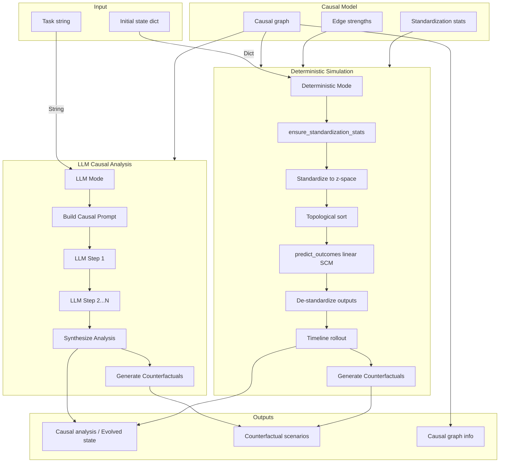

<!-- swarms/agents/cr_ca_agent.py — CRCAAgent (CR‑CA Lite) -->
# CRCAAgent 

Release: v1.2.0 — advanced analysis suite (optimization, time-series, Bayesian inference, async support, batch prediction)

Short summary
-------------
CRCAAgent is a lightweight causal reasoning Agent with LLM integration,
implemented in pure Python and intended as a flexible CR‑CA engine for Swarms.
It provides both LLM-based causal analysis and deterministic causal simulation,
focusing on the core ASTT primitives: a causal DAG, a linear structural
evolution operator (in z-space), and compact counterfactual generation.

Key properties
- LLM integration for sophisticated causal reasoning (like full CRCAAgent)
- Dual-mode operation: LLM-based analysis and deterministic simulation
- Minimal core dependencies (numpy + swarms Agent base), optional heavy deps (pandas/scipy/cvxpy) for advanced features
- Pure-Python causal graph (adjacency dicts) with rustworkx backend
- Linear/non-linear SCM evolution (tanh activation, interaction terms)
- Agent-first `run()` entrypoint (accepts task string or dict/JSON payloads)
- Batch prediction support for efficient ensemble forecasting
- Async/await support for concurrent operations
- Advanced optimization methods (gradient-based, Bellman dynamic programming)
- Time-series analysis (Granger causality, VAR estimation)
- Bayesian inference and information-theoretic measures
- Comprehensive root cause analysis and sensitivity analysis

Canonical import
----------------
Use the canonical agent import in application code:

```python
from path.to.crca import CRCAAgent
```

Quickstart
----------
Minimal example — deterministic mode: initialize, add edges, evolve state and get counterfactuals:

```python
from path.to.crca import CRCAAgent

agent = CRCAAgent(variables=["price", "demand", "inventory"])
agent.add_causal_relationship("price", "demand", strength=-0.5)
agent.add_causal_relationship("demand", "inventory", strength=-0.2)

state = {"price": 100.0, "demand": 1000.0, "inventory": 5000.0}
out = agent.run(initial_state=state, target_variables=["price", "demand"], max_steps=1)

print("Evolved:", out["evolved_state"])            # evolved world state
for sc in out["counterfactual_scenarios"][:5]:      # candidate CFs
    print(sc.name, sc.interventions, sc.probability)
```

LLM-based causal analysis example
----------------------------------

```python
from path.to.crca import CRCAAgent

agent = CRCAAgent(
    variables=["price", "demand", "inventory"],
    model_name="gpt-4o",
    max_loops=3
)
agent.add_causal_relationship("price", "demand", strength=-0.5)

# LLM mode: pass task as string
task = "Analyze how increasing price affects demand and inventory levels"
result = agent.run(task=task)

print("Causal Analysis:", result["causal_analysis"])
print("Counterfactual Scenarios:", result["counterfactual_scenarios"])
print("Analysis Steps:", result["analysis_steps"])
```

Agent-style JSON payload example (orchestrators)
------------------------------------------------

```python
import json
from path.to.crca import CRCAAgent

agent = CRCAAgent(variables=["price","demand","inventory"])
payload = json.dumps({"price": 100.0, "demand": 1000.0})
out = agent.run(initial_state=payload, target_variables=["price"], max_steps=1)
print(out["evolved_state"])
```

Why use `run()`
--------------
- **Dual-mode operation**: Automatically selects LLM mode (task string) or deterministic mode (initial_state dict)
- **LLM mode**: Performs sophisticated multi-loop causal reasoning with structured output
- **Deterministic mode**: Evolves the world state for `max_steps` using the deterministic evolution
  operator, then generates counterfactuals from the evolved state (consistent timelines)
- Accepts both dict and JSON payloads for flexible integration
- Returns a compact result dict used across Swarms agents

Architecture (high level)
-------------------------



Enhanced examples & full workflow
---------------------------------
The following examples show how to use the full power of CR-CA (data-driven fitting, non-linear SCM, AAP ensemble forecasting, and LLM-assisted analysis).

1) Full data-driven workflow (fit, map, ensemble)

```python
from CR_CA import load_crca_agent
import pandas as pd
import numpy as np

CRCAAgent = load_crca_agent()
agent = CRCAAgent(
    variables=["log_market_cap","trends","reddit_mentions","sentiment"],
    model_name="gpt-4o",
    max_loops=3,
    agent_name="cr-ca-forecaster",
    agent_description="CR-CA ensemble market-cap forecaster",
    enable_batch_predict=True,  # Enable batch prediction for efficiency
    max_batch_size=32,
    seed=42  # Reproducibility
)

# Load historical series (aligned, cleaned)
df = pd.read_csv("market_trends.csv", parse_dates=["date"])

# Estimate edge strengths and z-stats from a rolling window
agent.fit_from_dataframe(df, variables=["log_market_cap","trends","reddit_mentions","sentiment"], window=180)

# Map regression coefficients to SCM edges (fit_from_dataframe does much of this automatically,
# but you can also manually tune strengths/confidence)
agent.add_causal_relationship("trends", "log_market_cap", strength=0.25, confidence=0.9)
agent.add_causal_relationship("reddit_mentions", "log_market_cap", strength=0.15, confidence=0.8)

# Prepare factual state (most recent observation)
factual = {
    "log_market_cap": np.log(df["market_cap"].iloc[-1]),
    "trends": df["trends"].iloc[-1],
    "reddit_mentions": df["reddit_mentions"].iloc[-1],
    "sentiment": df["sentiment"].iloc[-1],
}

# Run an ensemble of AAP counterfactuals using batch prediction (v1.2.0+)
N = 200
factual_states = [factual] * N
interventions_list = [{}] * N  # or vary interventions per run
batch_predictions = agent._predict_outcomes_batch(factual_states, interventions_list)
ensemble = [pred["log_market_cap"] for pred in batch_predictions]

# Alternative: traditional loop (still supported)
# ensemble = []
# for i in range(N):
#     interventions = {}  # e.g., {"trends": factual["trends"] * 1.02}
#     pred = agent.aap(factual, interventions)
#     ensemble.append(pred["log_market_cap"])

# Aggregate ensemble predictions to mean/p10/p90
mean_pred = np.mean(ensemble, axis=0)
p10 = np.percentile(ensemble, 10, axis=0)
p90 = np.percentile(ensemble, 90, axis=0)
```

2) LLM + deterministic hybrid: use LLM to propose plausible interventions, then simulate

```python
from CR_CA import load_crca_agent
CRCAAgent = load_crca_agent()
agent = CRCAAgent(
    variables=["price","demand","inventory"],
    model_name="gpt-4o",
    max_loops=2,
    agent_name="cr-ca-llm-hybrid",
    agent_description="LLM-assisted intervention proposer"
)

# Ask the LLM to suggest interventions
task = "Suggest 5 realistic interventions that could raise demand without increasing price."
res = agent.run(task=task)
proposed = [s["interventions"] for s in res.get("counterfactual_scenarios", [])][:5]

# Simulate each proposed intervention using AAP
for interventions in proposed:
    out = agent.aap({"price":100,"demand":1000,"inventory":5000}, interventions)
    print("Interventions:", interventions, "-> price:", out.get("price"))
```

3) Inspecting graph, edges, and diagnostics

```python
from CR_CA import load_crca_agent
CRCAAgent = load_crca_agent()
agent = CRCAAgent(variables=["a","b","c"], model_name="gpt-4o", agent_name="cr-ca-debug")
agent.add_causal_relationship("a","b", strength=0.8, confidence=0.9, relation_type="direct")
print("Nodes:", agent.get_nodes())
print("Edges:", agent.get_edges())           # dict view with metadata
print("rustworkx edges:", agent._graph.edge_list())  # internal view for debugging
```

4) Advanced optimization: finding optimal interventions (v1.2.0+)

```python
from path.to.crca import CRCAAgent
import pandas as pd

agent = CRCAAgent(
    variables=["price", "demand", "inventory", "revenue"],
    seed=42
)
agent.add_causal_relationship("price", "demand", strength=-0.5)
agent.add_causal_relationship("demand", "inventory", strength=-0.2)
agent.add_causal_relationship("price", "revenue", strength=1.0)
agent.add_causal_relationship("demand", "revenue", strength=0.8)

initial_state = {"price": 100.0, "demand": 1000.0, "inventory": 5000.0, "revenue": 100000.0}

# Gradient-based optimization (requires scipy)
opt_result = agent.gradient_based_intervention_optimization(
    initial_state=initial_state,
    target="revenue",
    intervention_vars=["price"],
    constraints={"price": (80.0, 120.0)},  # price bounds
    method="L-BFGS-B"
)
print("Optimal intervention:", opt_result["optimal_intervention"])
print("Optimal revenue:", opt_result["optimal_target_value"])

# Bellman optimal intervention (multi-step planning)
bellman_result = agent.bellman_optimal_intervention(
    initial_state=initial_state,
    target="revenue",
    intervention_vars=["price"],
    horizon=5,
    discount=0.9
)
print("Optimal sequence:", bellman_result["optimal_sequence"])
print("Final state:", bellman_result["final_state"])
```

5) Time-series causal analysis (v1.2.0+)

```python
import pandas as pd
from path.to.crca import CRCAAgent

agent = CRCAAgent(variables=["price", "demand", "inventory"])
df = pd.read_csv("time_series_data.csv", parse_dates=["date"])

# Granger causality test
granger_result = agent.granger_causality_test(
    df=df,
    var1="price",
    var2="demand",
    max_lag=4
)
print("Granger causes:", granger_result["granger_causes"])
print("P-value:", granger_result["p_value"])

# Vector Autoregression (VAR) estimation
var_result = agent.vector_autoregression_estimation(
    df=df,
    variables=["price", "demand", "inventory"],
    max_lag=2
)
print("VAR coefficients:", var_result["coefficient_matrices"])
```

6) Bayesian inference and information theory (v1.2.0+)

```python
import pandas as pd
from path.to.crca import CRCAAgent

agent = CRCAAgent(variables=["price", "demand"])
df = pd.read_csv("data.csv")

# Bayesian edge inference
bayesian_result = agent.bayesian_edge_inference(
    df=df,
    parent="price",
    child="demand",
    prior_mu=0.0,
    prior_sigma=1.0
)
print("Posterior mean:", bayesian_result["posterior_mean"])
print("95% Credible interval:", bayesian_result["credible_interval_95"])

# Information-theoretic measures
info_result = agent.compute_information_theoretic_measures(
    df=df,
    variables=["price", "demand", "inventory"]
)
print("Entropies:", info_result["entropies"])
print("Mutual information:", info_result["mutual_information"])
```

7) Root cause analysis and sensitivity (v1.2.0+)

```python
from path.to.crca import CRCAAgent

agent = CRCAAgent(variables=["a", "b", "c", "d", "e"])
agent.add_causal_relationship("a", "b", strength=0.8)
agent.add_causal_relationship("b", "c", strength=0.6)
agent.add_causal_relationship("c", "d", strength=0.7)
agent.add_causal_relationship("a", "e", strength=0.5)

# Deep root cause analysis
rca_result = agent.deep_root_cause_analysis(
    problem_variable="d",
    max_depth=20,
    min_path_strength=0.01
)
print("Ultimate root causes:", rca_result["ultimate_root_causes"])
print("All root causes:", rca_result["all_root_causes"][:5])

# Sensitivity analysis
sensitivity_result = agent.sensitivity_analysis(
    intervention={"a": 1.0, "b": 2.0},
    target="d",
    perturbation_size=0.01
)
print("Sensitivities:", sensitivity_result["sensitivities"])
print("Most influential:", sensitivity_result["most_influential_variable"])

# Shapley value attribution
shapley_result = agent.shapley_value_attribution(
    baseline_state={"a": 0.0, "b": 0.0, "c": 0.0},
    target_state={"a": 1.0, "b": 2.0, "c": 1.5},
    target="d",
    samples=100
)
print("Shapley values:", shapley_result["shapley_values"])
```

8) Async operations and parallel uncertainty quantification (v1.2.0+)

```python
import asyncio
import pandas as pd
from path.to.crca import CRCAAgent

agent = CRCAAgent(
    variables=["price", "demand", "inventory"],
    bootstrap_workers=4,  # Parallel bootstrap sampling
    seed=42
)

# Async run
async def async_example():
    result = await agent.run_async(
        initial_state={"price": 100.0, "demand": 1000.0},
        max_steps=2
    )
    return result

# Parallel uncertainty quantification
df = pd.read_csv("data.csv")
uncertainty_result = agent.quantify_uncertainty(
    df=df,
    variables=["price", "demand", "inventory"],
    windows=200,
    alpha=0.95
)
print("Edge confidence intervals:", uncertainty_result["edge_cis"])

# Async uncertainty quantification
async def async_uncertainty():
    result = await agent.quantify_uncertainty_async(
        df=df,
        variables=["price", "demand", "inventory"],
        windows=200
    )
    return result
```

Notable implementation details (v1.1.0+)
---------------------------------------
The Lite agent has received a number of engine and hygiene improvements. Key implementation notes and where to find them:

**v1.2.0 additions:**
- Batch prediction uses vectorized numpy operations for efficient ensemble forecasting
- Async operations leverage `asyncio.get_running_loop().run_in_executor()` for non-blocking execution
- Optimization methods use scipy's `minimize()` with configurable methods (L-BFGS-B default)
- Time-series methods implement standard econometric techniques (OLS, F-tests)
- Bayesian inference uses conjugate prior updates for efficient posterior computation
- Information theory uses histogram-based entropy estimation
- Parallel bootstrap uses `ThreadPoolExecutor` when `bootstrap_workers > 0`
- Optional dependencies are detected at runtime with graceful fallbacks

**v1.1.0 foundations:**

- rustworkx-backed graph
  - The internal causal graph is backed by `rustworkx.PyDiGraph` while retaining the original dict-of-dicts view for backward compatibility.
  - Node index mapping helpers and sync logic live in `ceca_lite/crca-lite.py` (`_ensure_node_index`, `_node_to_index`, `_index_to_node`).

- Edge metadata
  - Edges now store metadata including `strength`, `confidence`, and `relation_type` (and optional interaction metadata). These are kept in the dict view and synchronized with rustworkx edge data.

- Non-linear SCM & interaction terms
  - A nonlinear evolution operator runs in z-space: see `_predict_z()` in `ceca_lite/crca-lite.py`.
  - Supports interaction terms (registered via `add_interaction_term` / stored in `interaction_terms`) and a saturating activation (`tanh`) to prevent explosive linear growth.
  - A shock-preservation heuristic (`shock_preserve_threshold`) preserves materially different observed z-values so benchmark-applied shocks propagate correctly.

- Abduction–Action–Prediction (AAP)
  - Full AAP workflow implemented in `counterfactual_abduction_action_prediction()` with an alias `aap()` for convenience.
  - Abduction infers per-node noise in z-space and preserves it during counterfactual prediction.

- Prediction caching (thread-safe)
  - Cached wrapper `_predict_outcomes_cached()` uses deterministic tuple keys and a FIFO eviction policy (evicts oldest 10% when full).
  - Toggle caching with `enable_cache(True/False)` and clear cache with `clear_cache()`.
  - A coarse-grained `threading.Lock` (`_prediction_cache_lock`) protects cache accesses in multi-threaded runs.

- Utilities added
  - `fit_from_dataframe()` (lightweight estimation of edge strengths and standardization stats).
  - Graph helpers: `_topological_sort()` (rustworkx preferred with fallback), `identify_causal_chain()`, `detect_confounders()`, `identify_adjustment_set()`.
  - Standardization behavior improved: `ensure_standardization_stats()` creates sensible fallbacks and `_predict_z()` preserves exogenous observed z when appropriate.

- CI, tests, and docs
  - `requirements.txt` lists minimal pinned deps for CI and local setup.
  - GitHub Actions workflow: `.github/workflows/sanity.yml` runs `examples/sanity_check.py` on push/PR.
  - Pytest smoke test: `tests/test_crca_core.py` exercises basic prediction, cache, and graph utilities.
  - Small README added at `ceca_lite/README.md` documenting the cache lock and sanity check usage.

These additions are intentionally conservative and backward-compatible: public APIs and the `run()` interface were not changed.

Complete method index (quick)
-----------------------------
The following is the public surface implemented by `CRCAAgent` (Lite) in
`CRCA/CRCA.py`.
LLM integration
- `_get_cr_ca_schema()` — CR-CA function calling schema for structured reasoning
- `step(task)` — Execute a single step of LLM-based causal reasoning
- `_build_causal_prompt(task)` — Build causal analysis prompt with graph context
- `_build_memory_context()` — Build memory context from previous analysis steps
- `_synthesize_causal_analysis(task)` — Synthesize final causal analysis using LLM
- `_run_llm_causal_analysis(task)` — Run multi-loop LLM-based causal analysis

Core graph & state
- `_ensure_node_exists(node)` — ensure node present in internal maps
- `add_causal_relationship(source, target, strength=1.0, ...)` — add/update edge
- `_get_parents(node)`, `_get_children(node)` — graph accessors
- `_topological_sort()` — Kahn's algorithm
- `get_nodes()`, `get_edges()`, `is_dag()` — graph introspection

Standardization & prediction
- `set_standardization_stats(var, mean, std)` — set z-stats
- `ensure_standardization_stats(state)` — auto-fill sensible stats
- `_standardize_state(state)` / `_destandardize_value(var, z)` — z-score transforms
- `_predict_outcomes(factual_state, interventions)` — evolution operator (linear SCM)
- `_predict_outcomes_cached(...)` — cached wrapper

Counterfactuals & reasoning
- `generate_counterfactual_scenarios(factual_state, target_variables, max_scenarios=5)`
- `_calculate_scenario_probability(factual_state, interventions)` — heuristic plausibility
- `counterfactual_abduction_action_prediction(factual_state, interventions)` — abduction–action–prediction (Pearl)

Estimation, analysis & utilities
- `fit_from_dataframe(df, variables, window=30, ...)` — WLS edge estimation and stats
- `quantify_uncertainty(df, variables, windows=200, ...)` — bootstrap CIs (supports parallel workers)
- `analyze_causal_strength(source, target)` — path/edge summary
- `identify_causal_chain(start, end)` — BFS shortest path
- `detect_confounders(treatment, outcome)` — identify confounders
- `identify_adjustment_set(treatment, outcome)` — find adjustment sets

Batch & performance
- `_predict_outcomes_batch(factual_states, interventions)` — vectorized batch prediction
- `enable_batch_predict` parameter — enable batch mode for efficiency
- `max_batch_size` parameter — control batch size

Optimization (v1.2.0+)
- `gradient_based_intervention_optimization(...)` — scipy-based gradient optimization (requires scipy)
- `bellman_optimal_intervention(...)` — dynamic programming multi-step optimization

Time-series analysis (v1.2.0+, requires pandas/scipy)
- `granger_causality_test(df, var1, var2, max_lag=4)` — Granger causality testing
- `vector_autoregression_estimation(df, variables, max_lag=2)` — VAR model estimation

Bayesian & information theory (v1.2.0+, requires pandas)
- `bayesian_edge_inference(df, parent, child, ...)` — Bayesian edge strength estimation
- `compute_information_theoretic_measures(df, variables)` — entropy and mutual information

Advanced analysis (v1.2.0+)
- `sensitivity_analysis(intervention, target, ...)` — sensitivity and elasticity analysis
- `deep_root_cause_analysis(problem_variable, ...)` — comprehensive root cause identification
- `shapley_value_attribution(baseline_state, target_state, target, ...)` — Shapley value attribution
- `multi_layer_whatif_analysis(scenarios, depth=3)` — multi-layer scenario analysis
- `explore_alternate_realities(factual_state, target_outcome, ...)` — reality exploration

Async operations (v1.2.0+)
- `run_async(...)` — async wrapper for `run()`
- `quantify_uncertainty_async(...)` — async uncertainty quantification
- `granger_causality_test_async(...)` — async Granger causality test
- `vector_autoregression_estimation_async(...)` — async VAR estimation

Return shape from `run()`
-------------------------
`run()` returns a dictionary with different keys depending on mode:

**LLM Mode** (when `task` is a string):
- `task`: the provided task/problem string
- `causal_analysis`: synthesized causal analysis report (string)
- `counterfactual_scenarios`: list of `CounterfactualScenario` objects
- `causal_graph_info`: {"nodes": [...], "edges": [...], "is_dag": bool}
- `analysis_steps`: list of analysis steps with memory context

**Deterministic Mode** (when `initial_state` is a dict):
- `initial_state`: the provided input state (dict)
- `evolved_state`: state after applying `max_steps` of the evolution operator
- `counterfactual_scenarios`: list of `CounterfactualScenario` with name/interventions/expected_outcomes/probability/reasoning
- `causal_graph_info`: {"nodes": [...], "edges": [...], "is_dag": bool}
- `steps`: `max_steps` used

Usage patterns & examples
-------------------------
1) LLM-based causal analysis (sophisticated reasoning)

```python
agent = CRCAAgent(
    variables=["a","b","c"],
    model_name="gpt-4o",
    max_loops=3
)
agent.add_causal_relationship("a","b", strength=0.8)

# LLM mode: pass task as string
task = "Analyze the causal relationship between a and b"
res = agent.run(task=task)
print(res["causal_analysis"])
print(res["analysis_steps"])
```

2) Deterministic simulation (script-style)

```python
agent = CRCAAgent(variables=["a","b","c"])
agent.add_causal_relationship("a","b", strength=0.8)
state = {"a":1.0, "b":2.0, "c":3.0}
res = agent.run(initial_state=state, max_steps=2)
print(res["evolved_state"])
```

3) Orchestration / agent-style (JSON payloads)

```python
payload = '{"a":1.0,"b":2.0,"c":3.0}'
res = agent.run(initial_state=payload, max_steps=1)
if "error" in res:
    print("Bad payload:", res["error"])
else:
    print("Evolved:", res["evolved_state"])
```

4) Lower-level testing & research

```python
pred = agent._predict_outcomes({"a":1.0,"b":2.0},{"a":0.0})
print(pred)
```

Design notes & limitations
--------------------------
- **LLM Integration**: Uses swarms Agent infrastructure for LLM calls. Configure model via `model_name` parameter. Multi-loop reasoning enabled by default.
- **Dual-mode operation**: Automatically selects LLM mode (task string) or deterministic mode (initial_state dict). Both modes generate counterfactuals using deterministic methods.
- **Linearity**: default `_predict_outcomes` is linear in standardized z-space. To model non-linear dynamics, subclass `CRCAAgent` and override `_predict_outcomes`.
- **Probabilities**: scenario probability is a heuristic proximity measure (Mahalanobis-like) — not a formal posterior.
- **Stats**: the engine auto-fills standardization stats with sensible defaults (`mean=observed`, `std=1.0`) via `ensure_standardization_stats` to avoid degenerate std=0 cases.
- **Dependencies**: Core functionality requires only numpy + swarms Agent base. Advanced features (optimization, time-series, Bayesian) require optional dependencies:
  - `pandas` — for data-driven fitting, uncertainty quantification, time-series analysis, Bayesian inference
  - `scipy` — for gradient-based optimization, Granger causality tests
  - `cvxpy` — for convex optimization (if added in future)
  - All optional dependencies are gracefully handled with feature detection

Extending & integration
-----------------------
v1.2.0 includes comprehensive advanced capabilities:
- **Optimization**: Gradient-based and Bellman dynamic programming methods
- **Bayesian inference**: Edge strength estimation with credible intervals
- **Time-series analysis**: Granger causality and VAR estimation
- **Information theory**: Entropy and mutual information measures
- **Root cause analysis**: Deep path-based analysis with strength filtering
- **Sensitivity analysis**: Perturbation-based sensitivity and elasticity
- **Attribution**: Shapley value for fair variable contribution
- **Reality exploration**: Multi-scenario optimization and ranking

For structure learning and additional statistical methods, future updates are planned. The current implementation provides a solid foundation for most causal inference workflows.

References
----------
- Pearl, J. (2009). *Causality: Models, Reasoning, and Inference*.
- Pearl, J., & Mackenzie, D. (2018). *The Book of Why*.

---
CRCAAgent (Lite) — lightweight causal reasoning Agent with LLM integration for Swarms.

Implementation: `CR-CA/CRCA.py`  
Canonical import: `from path.to.crca import CRCAAgent`  (or use `from path.to.crca import load_crca_agent()` in this repository layout)


Changelog
---------

- v1.2.0
  - Major feature expansion: advanced analysis suite
    - **Batch prediction**: Added `_predict_outcomes_batch()` for efficient vectorized predictions with `enable_batch_predict` and `max_batch_size` parameters
    - **Async support**: Full async/await support with `run_async()`, `quantify_uncertainty_async()`, `granger_causality_test_async()`, `vector_autoregression_estimation_async()`
    - **Optimization methods**: 
      - `gradient_based_intervention_optimization()` — scipy-based gradient optimization with constraints
      - `bellman_optimal_intervention()` — dynamic programming multi-step optimization
    - **Time-series analysis**:
      - `granger_causality_test()` — Granger causality testing with F-statistics
      - `vector_autoregression_estimation()` — VAR model estimation
    - **Bayesian inference**: `bayesian_edge_inference()` — Bayesian edge strength estimation with credible intervals
    - **Information theory**: `compute_information_theoretic_measures()` — entropy and mutual information calculations
    - **Advanced analysis**:
      - `sensitivity_analysis()` — sensitivity and elasticity analysis
      - `deep_root_cause_analysis()` — comprehensive root cause identification with path strength
      - `shapley_value_attribution()` — Shapley value for fair variable attribution
      - `multi_layer_whatif_analysis()` — multi-layer cascading scenario analysis
      - `explore_alternate_realities()` — reality exploration with optimization
    - **Performance improvements**:
      - Parallel bootstrap sampling via `bootstrap_workers` parameter
      - Reproducible randomness via `seed` parameter
      - Optional dependency detection (pandas/scipy) with graceful fallbacks
    - **Code optimization**: File size reduced to under 50k characters while maintaining full functionality

- v1.1.0
  - Small production hardening pass:
    - Added a coarse-grained thread-safe lock protecting the in-memory prediction cache to avoid basic race conditions in multi-threaded runs.
    - Introduced `requirements.txt` pin list for CI and local setup.
    - Added a minimal GitHub Actions sanity workflow (`.github/workflows/sanity.yml`) that runs `examples/sanity_check.py`.
    - Included a pytest smoke test (`tests/test_core.py`) that validates basic prediction, cache, and graph utilities.
    - Added `ceca_lite/README.md` documenting the cache lock and sanity-check usage.

- v1.0.0
  - Initial creation of CRCAAgent (Lite): core causal DAG, linear SCM evolution, counterfactual generation, and LLM integration.
